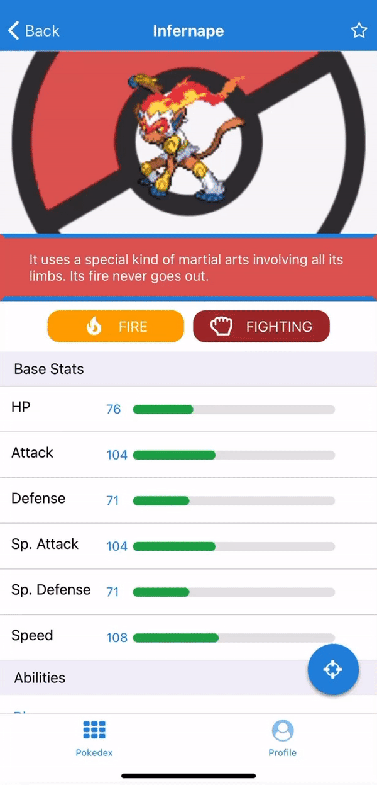
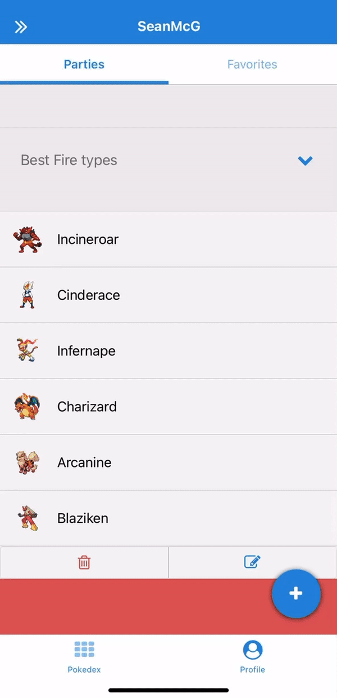

# Pokedex

A Pokedex mobile application that can display data on all 8 generations of Pokemon. The app also provides a team builder, in which users can create designated parties (groups) of Pokemon, and add Pokemon to a list of favorites. It was built with React-Native and <a href="https://expo.io/">Expo<a> for deployment/development. Originally <a href="https://firebase.google.com/">Firebase</a> was used for user authentication and database purposes. Now the app uses AsyncStorage. The branch "native-bridge-dev" contains the code from the ejected application, in which I used the <a href="https://reactnative.dev/docs/native-modules-ios">Native Bridge</a> to store and retrieve data into <a href="https://developer.apple.com/documentation/coredata">Core Data</a>. Meanwhile the "firebase" branch essentially represents version 1. Lastly, all data was fetched from the amazing <a href="https://pokeapi.co/">PokeAPI</a>.

# Try it out!

Watch the full demo of the current state of the app on my <a href="https://www.youtube.com/watch?v=j3-sw69TbPo&t=3s">YouTube channel</a> 

Download the Expo Client App on the <a href="https://itunes.apple.com/app/apple-store/id982107779">App Store</a>, and scan the QR code at https://expo.io/@smcgovern/pokedex with your phone's camera.

## Browse through 8 different generations of Pokemon

|  |  |  |
| :-------------: | :-------------: | :-------------: |

## Useful information on each individual Pokemon

|  |  |  |
| :-------------: | :-------------: | :-------------: |

## Local storage lets you create parties and mark your favorites

|  |  |  |  |
| :-------------: | :-------------: | :-------------: | :--------------: |
